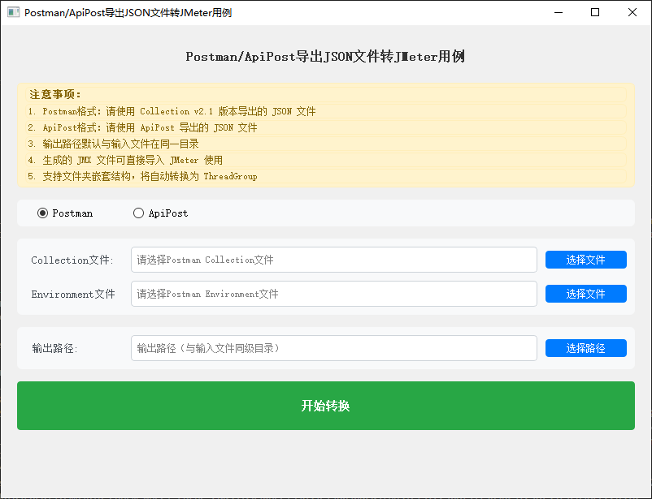

# Postman2Jmeter

将 Postman/ApiPost 导出的 JSON 文件转换为 JMeter 测试计划。

## 功能特性

- 支持 Postman Collection v2.1 格式
- 支持 ApiPost 导出的 JSON 格式
- 支持文件夹嵌套结构
- 自动转换为 JMeter ThreadGroup

## 软件界面



## 使用方法

1. 选择转换模式（Postman/ApiPost）
2. 选择输入文件
3. 选择输出路径
4. 点击转换按钮

## 安装

### 方式一：直接下载可执行文件

1. 从 [Releases](https://github.com/z7ping/Postman2Jmeter/releases) 页面下载最新版本的可执行文件
2. Windows 用户下载 `Postman2Jmeter.exe`
3. 双击运行即可使用

### 方式二：从源码安装

1. 克隆项目
```bash
git clone https://github.com/z7ping/Postman2Jmeter.git
cd Postman2Jmeter
```

2. 创建虚拟环境（推荐）
```bash
python -m venv venv
# Windows
venv\Scripts\activate
# Linux/Mac
source venv/bin/activate
```

3. 安装依赖
```bash
pip install -r requirements.txt
```

4. 安装项目
```bash
pip install -e .
```

5. 运行程序
```bash
# 方式1：直接运行
python src/Postman2Jmeter/main.py

# 方式2：通过安装的命令运行
Postman2Jmeter
```

### 方式三：打包使用

1. 克隆并安装依赖（参考方式二的步骤1-3）
2. 执行打包命令
```bash
python build_exe.py
```
3. 在 `dist` 目录下找到打包好的可执行文件

## 系统要求

- Python 3.8 或更高版本
- Windows/Linux/MacOS

## 目录结构

```
Postman2Jmeter/
├── src/
│   └── Postman2Jmeter/
│       ├── __init__.py
│       ├── main.py
│       ├── gui.py
│       ├── converter.py
│       ├── templates.py
│       └── resources/
│           └── icon.ico (可选)
├── setup.py
├── setup.cfg
├── MANIFEST.in
├── requirements.txt
├── README.md
└── build_exe.py
```